  

  
  
  
  

<h1 align="center">Hi, I'm Su 👋</h1>

  비전통적인 배경에서 개발을 시작해 <b>10년 넘게 프런트엔드</b>를 만들어 왔습니다. 
  지금은 빠르게 만드는 것만큼 <b>결과를 신뢰할 수 있는 AI 개발 경험</b>에 집중합니다.

  Frontend engineer building proactive personal software, verifiable AI workflows, and developer tools. 
  I like software where tests and evidence—not the model's self-report—decide when the work is done.

## Selected work

<table>
  <tr>
    <td width="50%" valign="top">
      <h3 align="center"><a href="https://tory.my">💬 Torya</a></h3>
      

        
      

      
대화와 하루의 흐름을 기억하고, 필요한 순간에 먼저 말을 걸어 기록과 회상을 돕는 <b>개인 AI 동반자</b>입니다. 모바일 중심 앱과 웹 서비스로 운영하고 있습니다.

    </td>
    <td width="50%" valign="top">
      <h3 align="center"><a href="https://github.com/su-record/vibe">✅ Vibe</a></h3>
      

        
        
        
      

      
Claude Code, Codex, Cursor를 감싸고 테스트·실행 기록·회귀 메모리 같은 <b>결정론적 게이트</b>로 AI 코딩 작업의 완료를 판정하는 verification harness입니다.

    </td>
  </tr>
  <tr>
    <td width="50%" valign="top">
      <h3 align="center"><a href="https://github.com/su-record/torya-ext">🔧 Torya DevTool</a></h3>
      

        
        
      

      
개발 중 발생한 브라우저의 console, network, DOM 오류를 Chrome 확장과 Native Messaging bridge를 통해 <b>코딩 에이전트의 수정 루프</b>로 연결합니다.

    </td>
    <td width="50%" valign="top">
      <h3 align="center"><a href="https://su-record.github.io/stories/">✍️ Stories</a></h3>
      

        
      

      
AI 개발 도구와 제품을 만들며 배운 것, 시행착오, 생각을 기록하는 마크다운 기반 블로그입니다. <a href="https://github.com/su-record/stories">Source →</a>

    </td>
  </tr>
</table>

## Toolbox

  

  <b>Agents</b> · Codex · Claude Code · MCP · deterministic evaluation

## GitHub

  <picture>
    <source media="(prefers-color-scheme: dark)" srcset="https://streak-stats.demolab.com?user=su-record&hide_border=true&background=00000000&ring=8B5CF6&fire=22D3EE&currStreakNum=F8FAFC&sideNums=E2E8F0&currStreakLabel=A78BFA&sideLabels=94A3B8&dates=64748B" />
    
  </picture>

  <picture>
    <source media="(prefers-color-scheme: dark)" srcset="https://github-readme-activity-graph.vercel.app/graph?username=su-record&hide_border=true&bg_color=00000000&color=94A3B8&line=8B5CF6&point=22D3EE&area=true&area_color=3B82F6&custom_title=Contribution%20graph" />
    
  </picture>

## Find me

[Torya](https://tory.my) · [Stories](https://su-record.github.io/stories/) · [LinkedIn](https://www.linkedin.com/in/%EC%88%98%EC%9B%90-%ED%95%A8-40108816a/) · [Vibe](https://github.com/su-record/vibe)

> 좋은 AI 개발 경험은 더 많은 프롬프트보다 더 명확한 완료 기준에서 시작한다고 믿습니다.
